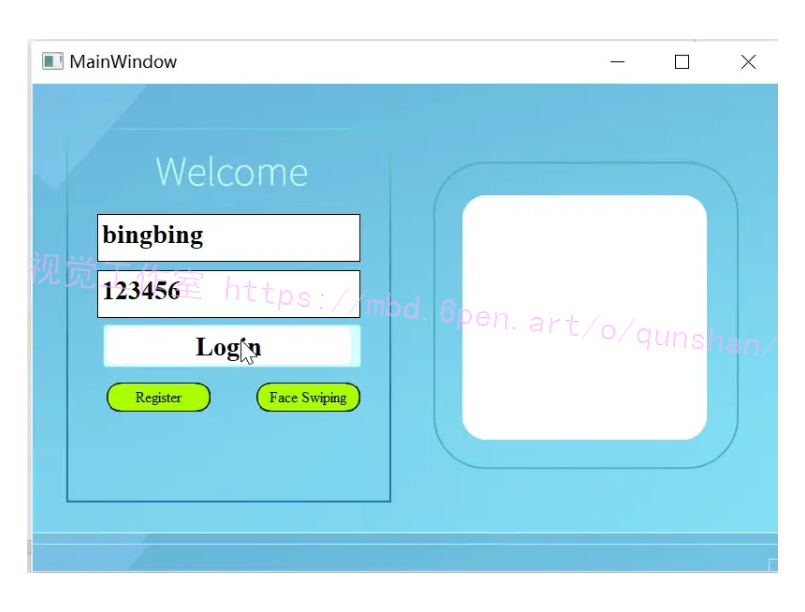
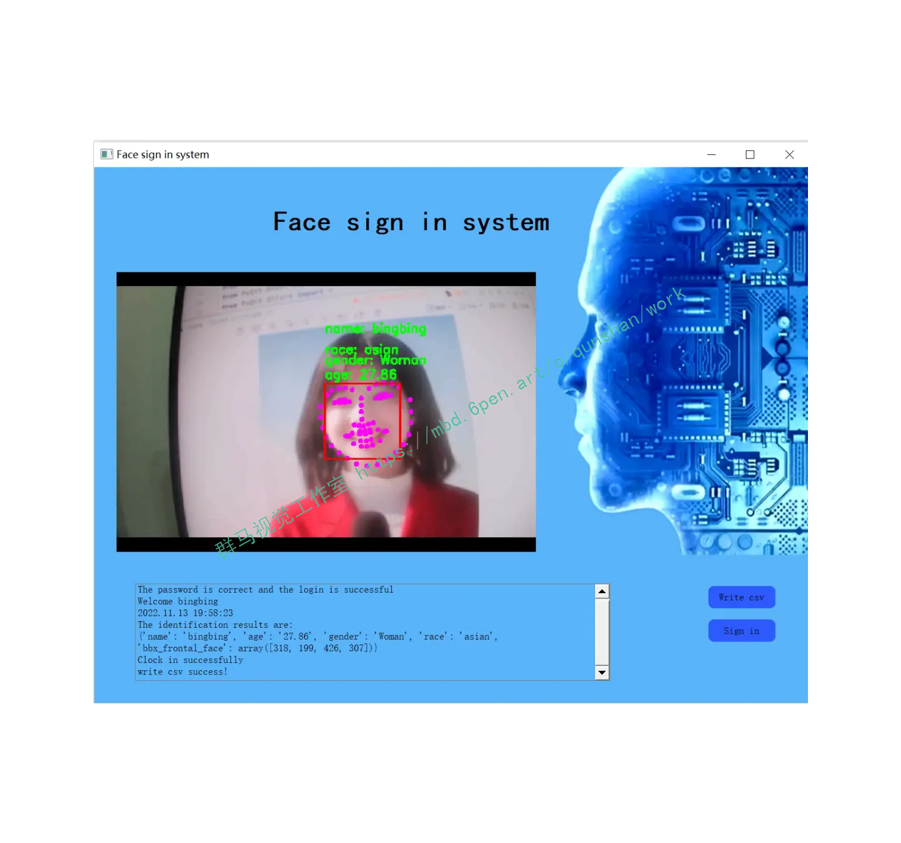
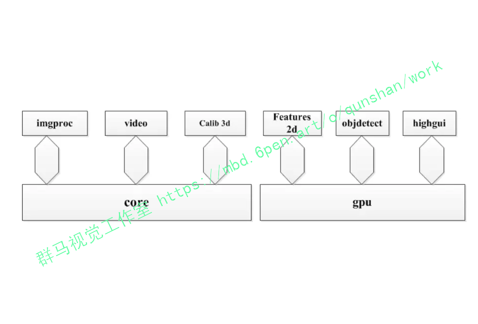
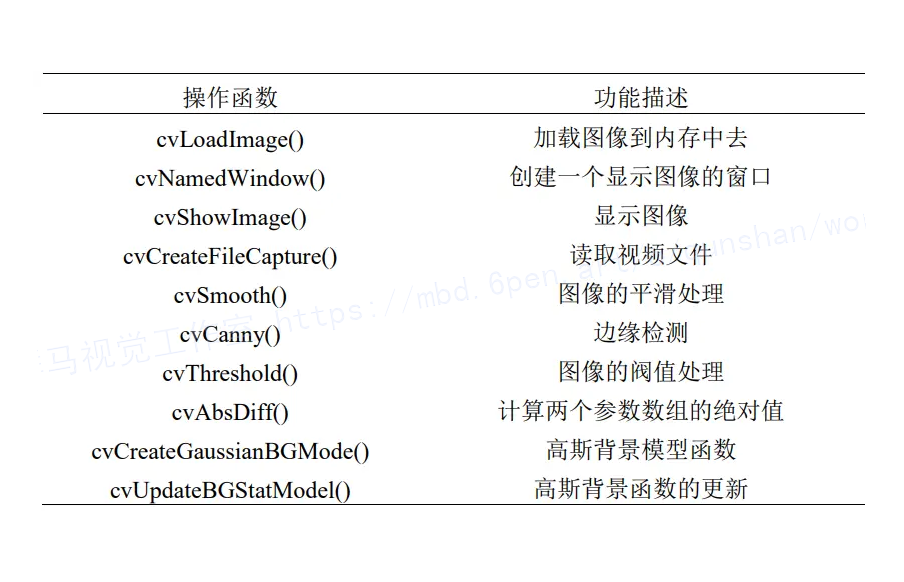
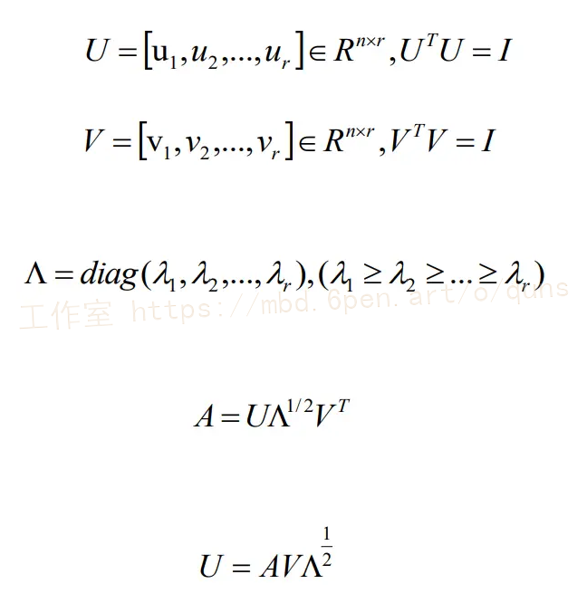
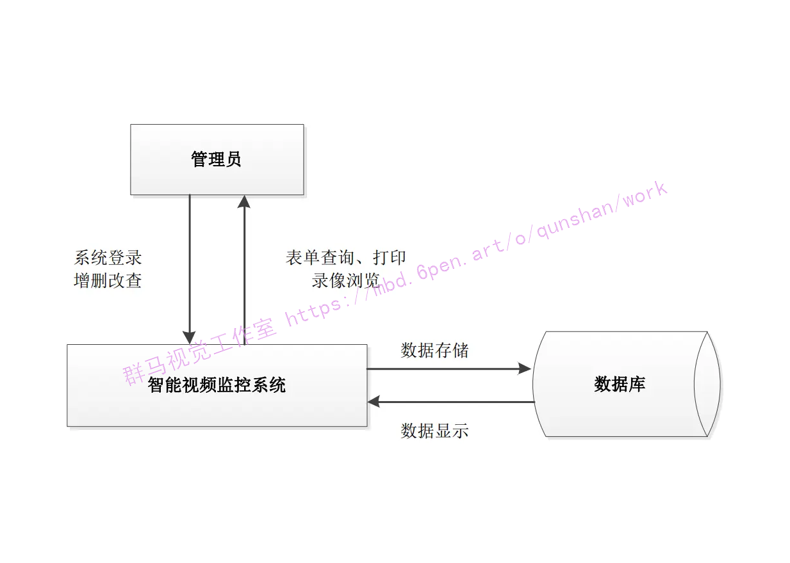
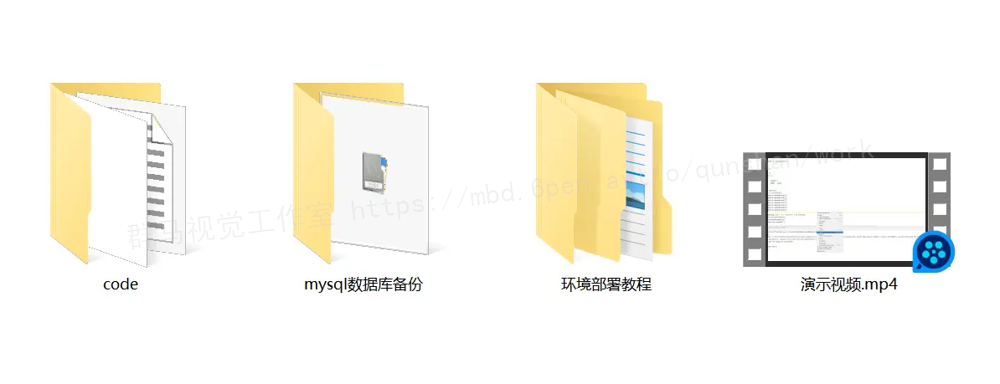


## 1.研究背景与意义

随着计算机科学和人工智能的快速发展，人脸识别技术成为了一个备受关注的研究领域。人脸识别系统是一种通过计算机视觉和模式识别技术来识别和验证人脸的系统。它在安全监控、人机交互、身份认证等领域具有广泛的应用前景。

在过去的几十年里，人脸识别技术取得了长足的进步。早期的人脸识别系统主要基于传统的图像处理算法，如特征提取、模式匹配等。然而，这些方法在复杂的环境下往往表现不佳，容易受到光照、姿态、表情等因素的干扰。近年来，随着深度学习的兴起，基于深度神经网络的人脸识别方法取得了显著的突破，成为当前最先进的技术。

OpenCV是一个开源的计算机视觉库，提供了丰富的图像处理和机器学习算法。它支持多种编程语言，如C++、Python等，具有广泛的应用领域。基于OpenCV的人脸识别系统可以利用其强大的图像处理和模式识别功能，实现高效准确的人脸检测、特征提取和匹配。

基于OpenCV的人脸识别系统具有许多重要的应用。首先，它可以应用于安全监控领域。通过将人脸识别技术与监控摄像头相结合，可以实现对特定人员的实时监测和识别，从而提高安全性和防范能力。其次，人脸识别系统可以应用于人机交互领域。通过识别用户的面部表情和动作，系统可以实现更加智能化的交互方式，提供更好的用户体验。此外，人脸识别系统还可以应用于身份认证和访问控制领域。通过对人脸进行识别和验证，可以实现更加安全可靠的身份认证方式，避免了传统的密码和卡片等易被盗用的问题。

然而，基于OpenCV的人脸识别系统仍然面临一些挑战和问题。首先，人脸识别技术在复杂的环境下仍然存在一定的误识别率和漏识别率。光照、姿态、表情等因素对人脸识别的准确性和稳定性有着重要影响。其次，大规模人脸数据库的管理和搜索也是一个具有挑战性的问题。随着人脸识别技术的发展，人脸数据库的规模不断增大，如何高效地管理和搜索这些数据成为了一个重要的研究方向。

因此，基于OpenCV的人脸识别系统的研究具有重要的意义。通过深入研究和改进人脸识别算法，可以提高系统的准确性和稳定性，拓展其应用领域。同时，研究人脸数据库的管理和搜索方法，可以提高系统的效率和可扩展性。基于OpenCV的人脸识别系统的发展将为安全监控、人机交互、身份认证等领域带来更加智能化和便捷化的解决方案，推动社会的进步和发展。

# 2.图片演示




# 3.视频演示
[基于Mysql和OpenCV的人脸识别系统（源码和部署教程）_哔哩哔哩_bilibili](https://www.bilibili.com/video/BV1LP411p7nu/?vd_source=ff015de2d29cbe2a9cdbfa7064407a08)

# 4. Qt 和 OpenCV 简介
Q是在1991年奇趣科技开发的基于C++的面向对象的一种编写界面的框架[9.3]。虽然它比微软的 MFC晚出来很久并且没有大型公司提供支持，但是其开源性使得一大批程序员自发地对其进行设计和优化，经过多年的发展变的十分强大，而且也越来越得到企业的认可。Qt还是一款可以跨平台的界面设计软件，在其下支持多种操作系统，具有很强的可移植性。Qt的体积相对比较轻巧，可以根据自己的需求添加一些库资源来使用，十分方便。Qt Creator是一款更为轻巧的Qt平台开发环境，具有集成的IDE使得程序员可以快速的上手，它可以通过编程实现界面的设计，也可以通过拖拉控件的形式实现界面的设计，十分人性化，可满足个人的喜好要求。它还提供了很多高效的工具，例如编辑器、调试器、项目管理和上下文感知系统等。
OpenCV是一些处理图像的库的结合体[1]，它拥有全部的源码和各类平台编译器从而支持多种平台操作系统，例如普通个人计算机 （Windows，Linux，Mac)、手机(Andriod，IOS）以及可以兼容Java等多种语言。它由高效的C和C++构成了一系列开源的通用算法和实用API函数接口，而且帮助文档强大并对一些基本功能提供了示例程序供开发人员参考，方便二次开发等。
OpenCV的内部结构主要是一些库和接口，包含一些单一的图像处理功能和复杂的目标检测等。我们可以整合这些模块来实现自定义的功能，也可以读计算法进行修改重新编译再使用，非常灵活[2]，其模块化的结构如图所示。




## 5.核心代码讲解

#### 5.1 config.py

根据给定的代码，可以将其封装为一个名为"EmotionDetection"的类，包含以下核心部分：

```python
class EmotionDetection:
    def __init__(self):
        self.path_model = 'emotion_detection/Modelos/model_dropout.hdf5'
        self.w, self.h = 48, 48
        self.rgb = False
        self.labels = ['angry', 'disgust', 'fear', 'happy', 'neutral', 'sad', 'surprise']

    def detect_emotion(self, image):
        # 实现情感检测的代码
        pass

class FaceRecognition:
    def __init__(self):
        self.path_images = "images_db"

    def recognize_face(self, image):
        # 实现人脸识别的代码
        pass
```

这样，我们可以使用`EmotionDetection`类来进行情感检测，使用`FaceRecognition`类来进行人脸识别。

这个config.py文件主要用于配置两个模块：emotion_detection（情绪检测）和face_recognition（人脸识别）。

在emotion_detection模块中，配置了以下参数：
- path_model：情绪检测模型的路径，这里设置为'emotion_detection/Modelos/model_dropout.hdf5'。
- w,h：模型输入图片的宽度和高度，这里设置为48。
- rgb：是否将图片转换为RGB格式，这里设置为False，即将图片转换为灰度图。
- labels：情绪类别的标签，包括'angry'（愤怒）、'disgust'（厌恶）、'fear'（恐惧）、'happy'（快乐）、'neutral'（中性）、'sad'（悲伤）和'surprise'（惊讶）。

在face_recognition模块中，配置了以下参数：
- path_images：存放人脸图像的文件夹路径，这里设置为"images_db"。

#### 5.2 deep_face.py

```python
from deepface import DeepFace

class FaceAnalyzer:
    def __init__(self, image_path):
        self.image_path = image_path
    
    def analyze_face(self):
        demography = DeepFace.analyze(self.image_path, actions=['age', 'gender', 'race', 'emotion'])
        return demography

image_path = "juan.jpg"
analyzer = FaceAnalyzer(image_path)
demography = analyzer.analyze_face()

print("Age: ", demography["age"])
print("Gender: ", demography["gender"])
print("Emotion: ", demography["dominant_emotion"])
print("Race: ", demography["dominant_race"])
```

这个程序文件名为deep_face.py，它使用了deepface库来进行人脸分析。程序首先导入DeepFace类，然后使用analyze方法对指定的图片进行分析，包括年龄、性别、种族和情绪等方面的分析。接着打印出分析结果中的年龄、性别、主要情绪和主要种族信息。

#### 5.3 Face_info.py

以下是将代码封装为类的核心部分：

```python


class FaceInfo:
    def __init__(self, input_type, image_path):
        self.input_type = input_type
        self.image_path = image_path

    def process_image(self):
        frame = cv2.imread(self.image_path)
        out = f_Face_info.get_face_info(frame)
        res_img = f_Face_info.bounding_box(out, frame)
        cv2.imshow('Face info', res_img)
        cv2.waitKey(0)

if __name__ == '__main__':
    parser = argparse.ArgumentParser(description="Face Info")
    parser.add_argument('--input', type=str, default='webcam', help="webcam or image")
    parser.add_argument('--path_im', type=str, help="path of image")
    args = vars(parser.parse_args())

    face_info = FaceInfo(args['input'], args['path_im'])
    face_info.process_image()
```

这个类接受两个参数：`input_type`和`image_path`，用于指定输入类型和图像路径。`process_image`方法加载图像，获取人脸信息，并绘制边界框。最后，通过`FaceInfo`类的实例来调用`process_image`方法。

这个程序文件名为Face_info.py，它的功能是使用OpenCV和imutils库来检测人脸并显示人脸信息。程序首先导入了f_Face_info模块，然后导入了cv2、time、imutils和argparse库。

接下来，程序使用argparse库创建了一个命令行参数解析器，用于指定输入类型和图像路径。默认情况下，输入类型为webcam，即使用摄像头作为输入。如果指定了--input参数为image，则需要提供--path_im参数来指定图像路径。

然后，程序读取了一张图像文件，路径为'./images/1 (2).jpg'。接着，调用f_Face_info模块的get_face_info函数来获取图像中的人脸信息。然后，调用f_Face_info模块的bounding_box函数来在图像上绘制人脸边界框。最后，使用cv2.imshow函数显示处理后的图像，并使用cv2.waitKey函数等待用户按下键盘任意键关闭窗口。

#### 5.4 f_Face_info.py

```python

class FaceRecognition:
    def __init__(self):
        self.rec_face = f_main.rec()

    def get_face_info(self, im):
        boxes_face = face_recognition.face_locations(im)
        out = []
        if len(boxes_face) != 0:
            for box_face in boxes_face:
                box_face_fc = box_face
                x0, y1, x1, y0 = box_face
                box_face = np.array([y0, x0, y1, x1])
                face_features = {
                    "name": [],
                    "bbx_frontal_face": box_face
                }

                face_image = im[x0:x1, y0:y1]

                face_features["name"] = self.rec_face.recognize_face2(im, [box_face_fc])[0]
                out.append(face_features)
        else:
            face_features = {
                "name": [],
                "bbx_frontal_face": []
            }
            out.append(face_features)
        return out

    def bounding_box(self, out, img):
        for data_face in out:
            box = data_face["bbx_frontal_face"]
            if len(box) == 0:
                continue
            else:
                x0, y0, x1, y1 = box
                img = cv2.rectangle(img,
                                    (x0, y0),
                                    (x1, y1),
                                    (0, 0, 255), 2)
                thickness = 2
                fontSize = 0.6
                step = 13
                try:
                    cv2.putText(img, "name: " + data_face["name"], (x0, y0 - step - 7), cv2.FONT_HERSHEY_SIMPLEX,
                                fontSize, (0, 255, 0), thickness)
                except:
                    pass
        return img

```

这个程序文件名为f_Face_info.py，它包含了一些函数和库的导入。主要功能是通过人脸识别来获取人脸信息并在图像上绘制边界框和标签。

程序首先导入了cv2、numpy和face_recognition等库，并从my_face_recognition模块中导入了f_main.rec()函数。

接下来定义了一个名为get_face_info的函数，它接受一个图像作为输入，并使用face_recognition库的face_locations函数来检测人脸位置。如果检测到人脸，则对每个人脸进行处理，提取人脸图像并使用rec_face.recognize_face2函数识别人脸。最后将人脸信息存储在一个列表中并返回。

然后定义了一个名为bounding_box的函数，它接受一个包含人脸信息的列表和一个图像作为输入。该函数遍历人脸信息列表，对每个人脸绘制边界框和标签，并返回绘制完成的图像。

整个程序的功能是通过人脸识别来获取人脸信息，并在图像上绘制边界框和标签。

#### 5.5 f_Face_info2.py

```python

class FaceRecognition:
    def __init__(self):
        self.rec_face = self.rec()

    def rec(self):
        # 实例化人脸检测器
        pass

    def get_face_info(self, im):
        # 人脸检测
        pass

    def bounding_box(self, out, img):
        # 绘制边界框和标签
        pass
```

这个程序文件名为f_Face_info2.py，它的功能是通过人脸识别获取人脸信息并在图像上标注人脸边界框和人脸姓名。程序中导入了cv2、numpy和face_recognition等库，并从my_face_recognition模块中导入了f_main.rec()函数。

程序定义了一个名为get_face_info的函数，该函数接受一个图像作为输入，并使用face_recognition库进行人脸检测。如果检测到人脸，则将人脸的位置信息和姓名信息存储在一个字典中，并将该字典添加到一个列表中。最后，将列表作为输出返回。

程序还定义了一个名为bounding_box的函数，该函数接受一个包含人脸信息的列表和一个图像作为输入。函数遍历人脸信息列表，根据人脸边界框的位置在图像上绘制矩形框，并在框上方显示人脸姓名。

整个程序的目的是通过人脸识别获取人脸信息，并在图像上标注人脸边界框和姓名。

#### 5.6 info.py

```python
# -*- coding: utf-8 -*-

from PyQt5 import QtCore, QtGui, QtWidgets

class Ui_Dialog_info(object):
    def setupUi(self, Dialog_info):
        Dialog_info.setStyleSheet("background-color: rgb(189,215,238)")
        Dialog_info.setObjectName("Dialog_info")
        Dialog_info.resize(394, 500)
        self.button_confirm = QtWidgets.QPushButton(Dialog_info)
        self.button_confirm.setGeometry(QtCore.QRect(260, 452, 112, 34))
        self.button_confirm.setObjectName("button_confirm")
        self.formLayoutWidget = QtWidgets.QWidget(Dialog_info)
        self.formLayoutWidget.setGeometry(QtCore.QRect(40, 50, 331, 400))
        self.formLayoutWidget.setObjectName("formLayoutWidget")
        self.formLayout = QtWidgets.QFormLayout(self.formLayoutWidget)
        self.formLayout.setContentsMargins(0, 0, 0, 0)
        self.formLayout.setObjectName("formLayout")
        self.label = QtWidgets.QLabel(self.formLayoutWidget)
        self.label.setObjectName("label")
        self.formLayout.setWidget(0, QtWidgets.QFormLayout.LabelRole, self.label)
        self.label_2 = QtWidgets.QLabel(self.formLayoutWidget)
        self.label_2.setObjectName("label_2")
        self.formLayout.setWidget(2, QtWidgets.QFormLayout.LabelRole, self.label_2)
        self.label_3 = QtWidgets.QLabel(self.formLayoutWidget)
        self.label_3.setObjectName("label_3")
        self.formLayout.setWidget(4, QtWidgets.QFormLayout.LabelRole, self.label_3)
        self.label_4 = QtWidgets.QLabel(self.formLayoutWidget)
        self.label_4.setObjectName("label_4")
        self.formLayout.setWidget(6, QtWidgets.QFormLayout.LabelRole, self.label_4)

        self.label_5 = QtWidgets.QLabel(self.formLayoutWidget)
        self.label_5.setObjectName("label_5")
        self.formLayout.setWidget(7, QtWidgets.QFormLayout.LabelRole, self.label_5)
        self.label_6 = QtWidgets.QLabel(self.formLayoutWidget)
        self.label_6.setObjectName("label_6")
        self.formLayout.setWidget(8, QtWidgets.QFormLayout.LabelRole, self.label_6)
        self.label_7 = QtWidgets.QLabel(self.formLayoutWidget)
        self.label_7.setObjectName("label_7")
        self.formLayout.setWidget(9, QtWidgets.QFormLayout.LabelRole, self.label_7)
        self.label_8 = QtWidgets.QLabel(self.formLayoutWidget)
        self.label_8.setObjectName("label_8")
        self.formLayout.setWidget(10, QtWidgets.QFormLayout.LabelRole, self.label_8)
        self.label_9 = QtWidgets.QLabel(self.formLayoutWidget)
        self.label_9.setObjectName("label_9")
        self.formLayout.setWidget(11, QtWidgets.QFormLayout.LabelRole, self.label_9)

        self.line_id = QtWidgets.QLineEdit(self.formLayoutWidget)
        self.line_id.setObjectName("line_id")
        self.formLayout.setWidget(0, QtWidgets.QFormLayout.FieldRole, self.line_id)
        self.line_name = QtWidgets.QLineEdit(self.formLayoutWidget)
        self.line_name.setObjectName("line_name")
        self.formLayout.setWidget(2, QtWidgets.QFormLayout.FieldRole, self.line_name)
        self.line_sex = QtWidgets.QLineEdit(self.formLayoutWidget)
        self.line_sex.setObjectName("line_sex")
        self.formLayout.setWidget(4, QtWidgets.QFormLayout.FieldRole, self.line_sex)
        self.line_address = QtWidgets.QLineEdit(self.formLayoutWidget)
        self.line_address.setObjectName("line_address")
        self.formLayout.setWidget(6, QtWidgets.QFormLayout.FieldRole, self.line_address)

        self.line_passwords = QtWidgets.QLineEdit(self.formLayoutWidget)
        self.line_passwords.setObjectName("line_passwords")
        self.formLayout.setWidget(7, QtWidgets.QFormLayout.FieldRole, self.line_passwords)
        self.line_age = QtWidgets.QLineEdit(self.formLayoutWidget)
        self.line_age.setObjectName("line_name")
        self.formLayout.setWidget(8, QtWidgets.QFormLayout.FieldRole, self.line_age)
        self.line_race = QtWidgets.QLineEdit(self.formLayoutWidget)
        self.line_race.setObjectName("line_race")
        self.formLayout.setWidget(9, QtWidgets.QFormLayout.FieldRole, self.line_race)
        self.line_emotion = QtWidgets.QLineEdit(self.formLayoutWidget)
        self.line_emotion.setObjectName("line_emotion")
        self.formLayout.setWidget(10, QtWidgets.QFormLayout.FieldRole, self.line_emotion)
        self.line_check = QtWidgets.QLineEdit(self.formLayoutWidget)
        self.line_check.setObjectName("line_check")
        self.formLayout.setWidget(11, QtWidgets.QFormLayout.FieldRole, self.line_check)

        self.retranslateUi(Dialog_info)
        QtCore.QMetaObject.connectSlotsByName(Dialog_info)

        Dialog_info.setTabOrder(self.line_id, self.line_name)
        Dialog_info.setTabOrder(self.line_name, self.line_sex)
        Dialog_info.setTabOrder(self.line_sex, self.line_address)

        Dialog_info.setTabOrder(self.line_address, self.line_passwords)
        Dialog_info.setTabOrder(self.line_passwords, self.line_age)
        Dialog_info.setTabOrder(self.line_age, self.line_race)
        Dialog_info.setTabOrder(self.line_race, self.line_emotion)
        Dialog_info.setTabOrder(self.line_emotion, self.line_check)

    def retranslateUi(self, Dialog_info):
        _translate = QtCore.QCoreApplication.translate
        Dialog_info.setWindowTitle(_translate("Dialog_info", "Information Details"))
        self.button_confirm.setText(_translate("Dialog_info", "Determine"))
        self.label.setText(_translate("Dialog_input", "Name："))
        self.label_2.setText(_translate("Dialog_input", "Student ID*："))
        self.label_3.setText(_translate("Dialog_input", "Gender："))
        self.label_4.setText(_translate("Dialog_input", "Native place："))
        self.label_5.setText(_translate("Dialog_input", "Password："))
        self.label_6.setText(_translate("Dialog_input", "Age："))
        self.label_7.setText(_translate("Dialog_input", "Race："))
        self.label_8.setText(_translate("Dialog_input", "Time："))
        self.label_9.setText(_translate("Dialog_input", "Sign status："))
```

这是一个名为info.py的程序文件，它是一个使用PyQt5生成的用户界面文件。该文件定义了一个名为Ui_Dialog_info的类，该类用于设置和显示一个信息对话框。

该对话框的背景颜色为rgb(189,215,238)，大小为394x500像素。对话框中包含一个确认按钮和一个表单布局，表单布局中包含了一些标签和文本框。

标签包括姓名、学生ID、性别、籍贯、密码、年龄、种族、时间。对应的文本框用于输入相应的信息。

除了设置界面布局和文本内容外，该文件还定义了一些与界面交互的方法和信号槽连接。

该文件的目的是为了创建一个信息对话框，用于输入和显示一些个人信息。

## 6.系统整体结构

整体功能和构架概述：

该工程涉及人脸识别和信息管理的功能。主要包括以下模块：
1. 人脸识别模块：使用深度学习模型进行人脸分析，包括年龄、性别、种族和情绪等方面的分析。
2. 人脸信息获取模块：通过人脸识别获取人脸信息，并在图像上标注人脸边界框和姓名。
3. 信息管理模块：提供一个用户界面，用于输入和显示个人信息。

下面是每个文件的功能整理：

| 文件名 | 功能 |
|-------|------|
| config.py | 配置情绪检测和人脸识别模块的参数 |
| deep_face.py | 使用deepface库进行人脸分析，包括年龄、性别、种族和情绪等方面的分析 |
| Face_info.py | 使用OpenCV和imutils库检测人脸并显示人脸信息 |
| f_Face_info.py | 通过人脸识别获取人脸信息并在图像上绘制边界框和标签 |
| f_Face_info2.py | 通过人脸识别获取人脸信息并在图像上标注人脸边界框和姓名 |
| info.py | 创建一个信息对话框，用于输入和显示个人信息 |
| input_dialog.py | 创建一个输入对话框，用于输入用户名和密码 |
| login2.py | 创建一个登录界面，用于用户登录 |
| ui.py | 创建一个用户界面，用于显示和管理个人信息 |
| my_face_recognition\f_face_recognition.py | 人脸识别模块，包括人脸检测和人脸特征提取 |
| my_face_recognition\f_main.py | 人脸识别模块的主要功能，包括人脸识别和人脸信息存储 |
| my_face_recognition\f_storage.py | 人脸信息存储模块，用于存储和管理人脸信息 |

以上是对每个文件功能的简要概括，具体的实现细节可能需要查看每个文件的代码来进一步了解。

# 7.人脸识别模块设计
人脸识别技术的研究最早是由 Bledsoe在一篇技术报告中提出的，该报告以人脸特征点的距离、比率等参数作为人脸特征，搭建了一个半自动的人脸识别系统。之后在各国学者的共同努力下，人脸识别技术得到了不停的优化和改进，逐渐发展和成熟，从而在社会生活中得到广泛的应用。
目前国内外研究较为广泛的人脸识别方法有:(1)基于脸部几何特征的人脸识别方法;(2）基于特征脸的人脸识别方法;（3）基于神经网络的人脸识别方法;(4)基于局部特征的人脸识别方法;(5）基于弹性匹配的人脸识别方法等。本文采用基于特征脸的人脸识别方法。
一、基于PCA的人脸识别算法
PCA是一种常用的数据分析方法[6-8]，它的原理是将原始数据转化成线性无关的维度表示，提取主要的特征分量并进行降维从而达到模型简化的效果，其广泛应用在一些数学计算领域。
该方法的中心思想就是找出人脸图像重要部分来进行一个转化投影，获得直观易计算的量，把不相干内容去掉。识别也是先进行转化再与前者对比来判断系数的大小看是否是同一个人。具体的实现是以K-L变换为主将要训练的人脸库转化成特征脸空间并投影，将高维向量转化为低维向量。识别过程是将人脸区域投影到前面的特征脸空间来获得每个测试样本的特征系数，再将该值与训练样本的投影值进行比较获得可信度来判断其身份。该方法从人脸库训练和识别都不是很复杂且速度和识别率较高。
K-L变换的存在就是为了将庞大的数据简单化,即在这些数据中舍弃不必要的数据而筛选出重要的数据。主要是找到一个矩阵，让原来样本矩阵乘以这个找到的矩阵以获得一个新的矩阵，这个新的矩阵就比原来样本的矩阵少了许多维度，即完成了数据的筛选和达到降维的目的。在实际应用中，在进行K-L变换时所做的一些工作计算量还是比较大的，所以需要再引入奇异值分解的方法来辅助和简化协方差矩阵的特征向量，具体原理和过程如下:


# 8.MySQL 数据库设计
在上面己经设计好了监控界凹、管理，所以为了视频监控后续更方健的直看以但是还没有对这些功能进行统一的归纳管理，所以为了视频监及管理，本系统引入了MySQL数据库，具体结构如下图所示。


# 9.系统整合
下图[完整源码＆环境部署视频教程＆自定义UI界面](https://s.xiaocichang.com/s/a71c45)


参考博客[《基于Mysql和OpenCV的人脸识别系统（源码和部署教程）》](https://mbd.pub/o/qunshan/work)


# 10.参考文献
---
[1][廖文军](https://s.wanfangdata.com.cn/paper?q=%E4%BD%9C%E8%80%85:%22%E5%BB%96%E6%96%87%E5%86%9B%22).[基于连续Adaboost算法的多角度人脸检测技术研究与实现](https://d.wanfangdata.com.cn/periodical/D209228)[J].南京邮电大学.2012.DOI:10.7666/d.d209228.

[2][李友坤](https://s.wanfangdata.com.cn/paper?q=%E4%BD%9C%E8%80%85:%22%E6%9D%8E%E5%8F%8B%E5%9D%A4%22).[BP神经网络的研究分析及改进应用](https://d.wanfangdata.com.cn/thesis/Y2133814)[D].2012.

[3][赵晓辉](https://s.wanfangdata.com.cn/paper?q=%E4%BD%9C%E8%80%85:%22%E8%B5%B5%E6%99%93%E8%BE%89%22).基于改进的分块LBP人脸识别算法研究[D].2012.

[4][张惠发](https://s.wanfangdata.com.cn/paper?q=%E4%BD%9C%E8%80%85:%22%E5%BC%A0%E6%83%A0%E5%8F%91%22).人脸识别的关键问题研究[D].2012.

[5][褚勤](https://s.wanfangdata.com.cn/paper?q=%E4%BD%9C%E8%80%85:%22%E8%A4%9A%E5%8B%A4%22).基于小波分析和支持向量机的人脸识别方法研究[D].2012.


---
#### 如果您需要更详细的【源码和环境部署教程】，除了通过【系统整合】小节的链接获取之外，还可以通过邮箱以下途径获取:
#### 1.请先在GitHub上为该项目点赞（Star），编辑一封邮件，附上点赞的截图、项目的中文描述概述（About）以及您的用途需求，发送到我们的邮箱
#### sharecode@yeah.net
#### 2.我们收到邮件后会定期根据邮件的接收顺序将【完整源码和环境部署教程】发送到您的邮箱。
#### 【免责声明】本文来源于用户投稿，如果侵犯任何第三方的合法权益，可通过邮箱联系删除。